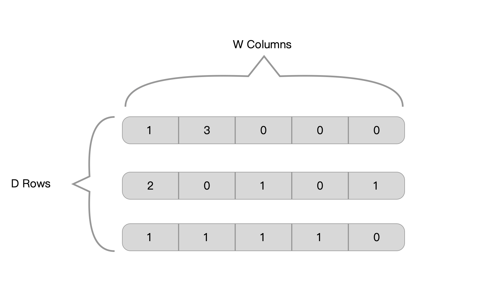
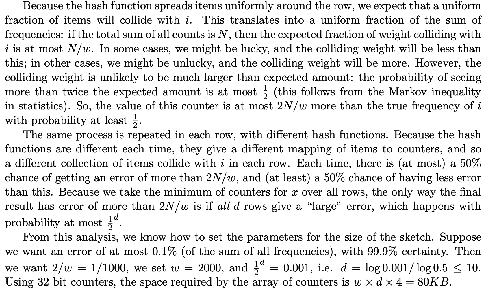

# Count-min Sketch


## 原理

### TLTR

count-min sketch(cm sketch) 是一种基于概率数据结构，它可以在一定的容错率的情况下，实时给出数据流中数据出现的频率，它和传统map不一样的是，它的占用空间是固定的，不会随着数据增多而线性增长。

### 设计实现

> 设计要求：
>
> 1. 实时记录数据流中item的访问次数。
> 2. 在任意时候指定一个item，可以在固定时间内算出其访问次数。

为满足以上需求，count-min设计了一个w列d行的一个二维数据，数组单元数字代表其被访问的次数。这里D行分别对应一个独立的hash函数。



#### 记录数据流中数据

针对每个`item`,根据每一行的hash函数可以算出其hash值`value`,然后对列数进行取余 `value%n`，就可以得到该item在这一行的index。

```go
// item 为数据流的数据
// A
for i,row := range rows{// 循环遍历所有行
  hash := hashfuns[i]// 取第i行的hash函数
  value := hash(item) // 算出item的hash值
  index := value%n 		// 计算其hash值的index
  cms[i][index]++ // 单元格数加1
}
```

#### 计算给定item的访问次数

对于要计算的item，也是分别计算其hash值，然后取出每一行对应的数值[x1,x2,x3]。然后返回 min(x1,x2,x3) 就是该item的访问次数

```go
frq := +inf
for i,row := range rows{// 循环遍历所有行
  hash := hashfuns[i] // 取第i行的hash函数
  value := hash(item) // 算出item的hash值
  index := value%w 		// 计算其hash值的index
  frq = min(frq,cms[i][index])
}
return frq
```


以上就是这个算法的全部。总结来说，对于每个数据，算出其在每行的分布，并更新其对应的数值。对于每次查询，返回其在每行对应数值的最小项。


### 误差分析

在假定hash算法足够随机的情况下，在一行上元素i,j 碰撞的期望值是 1/w.(w是一行的元素).根据马尔可夫不等式，期望为2/w的可能性小于1/2。那么如果我们错误率最高为0.1%，那么 2/w=0.001  => w=2000。也就算说当有2000列的时候，hash冲突的概率为0.1%，其精确度为50%。

因为cms有d行，我们这里去最小的值，那么只要有一行数是对的，最终结果都是对的，所以精确度是 0.5^d。换句话说，只有所有行都错了，才是不精确的。如果我们希望99.9%的精确度，那么就是0.5^d = 0.001 => d = 10.

> 


### 


## 代码实现

- 对比不对参数，不同数据下的表现


## 实际应用


## 对比

- hyperloglog

- bloomfilter

  和bloomfilter过滤器的原理特别像，只是加了一个计数器，可以统计频率。

